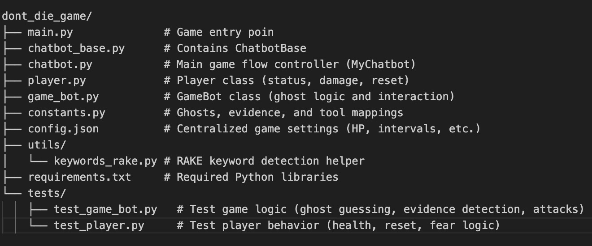

# Don't Die

**Don't Die** is a command-line ghost-hunting game where you must collect evidence using various tools and correctly identify the ghost before it kills you.

## How to Play

- Choose a name and your assistant bot's name.
- Use tools like Spirit Box, EMF Reader, and UV Light to search for ghost evidence.
- Every 5 rounds, the ghost will become more aggressive and may attack.
- Use hints if needed, but it will increase your fear and reduce your sanity.
- Identify the ghost correctly to survive and win the game.

## Features

- 6 different ghost types with unique evidence combinations.
- 7 investigative tools to collect evidence.
- Dynamic health, sanity, and fear mechanics.
- ASCII ghost visuals for each ghost type.
- Keyword recognition powered by NLTK for flexible player input.
- Modular, extensible codebase structured for maintainability.

## Project Structure  
Because typing into markdown is confusingly structured, use the screenshot.  


## Installation & Setup  

### 1. Clone the repository or download the code  
```bash
git clone <your-repo-url>
cd don‘t_die_game
``` 

### 2. Install required packages  
```bash
conda create --name nlp python=3.10
conda activate nlp
pip install -r requirements.txt
```

**NLTK Setup (very important!)**  
This project uses nltk for keyword extraction. You must download two resources the first time you run:  

```python
import nltk
nltk.download('punkt')
nltk.download('stopwords')
exit()
```
**Troubleshooting**  
LookupError: punkt_tab not found  
If you see this: Resource punkt_tab not found...  
It means your nltk install is broken. To fix:  
```bash
rm -rf ~/nltk_data
rm -rf /opt/miniconda3/envs/nlp/nltk_data
find . -name "*.pyc" -delete

pip uninstall nltk
pip install nltk==3.8.1
```
and do the NLTK Setup again.  

### 3. Run the game  
```bash
python -m dont_die_game.main
```

## Configuration  
The game settings can be adjusted in config.json，you can change these values to customize the difficulty.  

## Running tests  
This project includes unit tests for critical game components such as the `Player` and `GameBot` classes.  

### How to run tests  
Use Python’s built-in `unittest` module to automatically discover and run tests:  

```bash
python -m unittest discover tests
```
This will run all the tests in the entire tests/ folder.  
  
Or run a specific test:  

`test_player.py`: Verifies player mechanics like damage, fear, sanity, and reset.  
```bash
python -m unittest dont_die_game.tests.test_player
```

`test_game_bot.py`: Tests core gameplay logic such as evidence collection, ghost guessing, hint effects, and attack cycles.  
```bash
python -m unittest dont_die_game.tests.test_game_bot
```